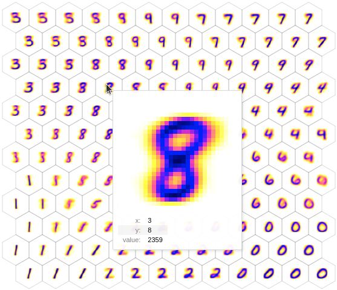
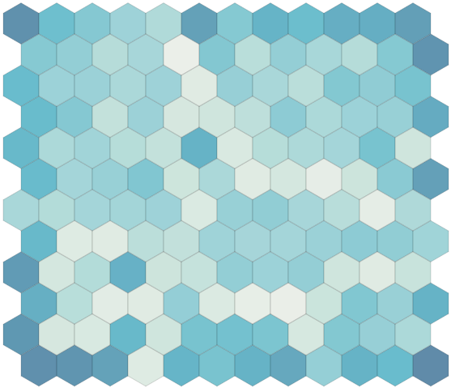

# All of Somap

A self-organizing map (SOM) is a type of artificial neural network that is trained using unsupervised learning to produce a low-dimensional, typically two-dimensional, representation of input data. It's like a map that organizes itself to represent different patterns or features found in the input data, arranging similar data close together and dissimilar data far apart. This makes it useful for visualizing complex data in a way that highlights its inherent similarities and differences.

## Input data

SOMs can take any kind of input data as long as it can be represented as vectors of values. For example, a 28x28 MNIST image will be internally represented as a flatten vector of 784 values. You can directly pass your unflatten values to a ***Somap*** SOM so that it remembers the shape of your data during the rendering step.

To help you test quickly your SOMs against common datasets, you can load them via `somap.datasets`:

```python
import somap as smp

# Load the MNIST dataset as a Numpy array of shape (60000, 28, 28)
data = smp.datasets.MNIST().data
```

See [this page](api/datasets.md) for a list of integrated datasets.

??? info "Upcoming versions"

    In addition to classic bottum-up driving inputs described above, future versions of ***Somap*** will support extra inputs for lateral contextual and top-down modulatory inputs.

## Creating SOMs

### Universal parameters

In ***Somap***, SOMs are defined by:

* A ***shape***: Tuple of 2 ints (***Somap*** only support 2 dimensional maps).
* A ***topology***: Either 'square' for regular square grid, or 'hex' for hexagonal grid.An hexagonal grid has a finer resolution when dealing with near neighborhood (6 direct neighbors vs 4 for the square grid).
* A ***borderless*** option: If True, the 2D map joins its opposite borders like in a tore. A borderless map has the advantage of not privileging any node of the map. Otherwise, corner- and border-nodes are generally over-activated as a result of arranging dissimilar data far apart.
* An ***input_shape***: Tuple of ints. Necessary to initialize the prototype weights matrix.
* The ***params*** of the specific SOM model: Depends on the chosen SOM.

The SOM algorithm involves initializing a grid of nodes, each with a randomly assigned weight vector. During training, each input data point is compared to all nodes, and the node with the weight vector most similar to the input (the "Best Matching Unit", aka BMU) is identified. The weights of this node and its neighbors are then adjusted to become more like the input data, gradually organizing the grid so that similar data points are mapped to nearby nodes.

Different kinds of SOMs can be imagined depending on:

* The distance function: how each input data point is compared to all node.
* The neighborhood function: how much each node is considered depending on its distance to the BMU.
* The learning rate function: how much the weights are updated at each step.
* The update function: how is the update performed.

### Static Kohonen SOM

The simplest SOM available in ***Somap*** is a time-independent version of the Kohonen SOM, called `StaticKsom`. It is defined by 2 parameters: 

* `sigma`: The width of the Gaussian neighborhood function around the Best Matching Unit (BMU). A larger sigma value means a wider neighborhood, where more nodes are influenced significantly during each training step. The influence of the BMU on neighboring nodes decreases with distance in a Gaussian manner, meaning nodes closer to the BMU are adjusted more significantly than those further away.
* `alpha`: The learning rate for the SOM. It dictates how much the weights of the nodes in the network are adjusted in response to each input data point.

```python
model = smp.StaticKsom(
    shape = (11, 13), 
    topography = "hex", 
    borderless = False, 
    input_shape = (28, 28), 
    params = smp.KsomParams(sigma=0.3, alpha=0.5)
)
```

### Kohonen SOM

The classic Kohonen SOM is defined by the following parameters:

* `t_f`: The final time or iteration step of the training process. It represents when the training of the SOM will end. The training typically involves gradually decreasing the learning rate and the neighborhood radius over time.
* `sigma_i` and `sigma_f`: The initial and final values of the width of the Gaussian neighborhood function around the Best Matching Unit (BMU). A larger sigma value means a wider neighborhood, where more nodes are influenced significantly during each training step. `sigma_i` is larger to allow broader learning initially, and `sigma_f` is smaller, focusing the learning more locally towards the end of training.
* `alpha_i` and `alpha_f`: The initial and final learning rates. The learning rate controls how much the weights of the SOM nodes are adjusted during training. A higher initial learning rate allows the network to quickly adapt to the data, while the lower final rate allows for finer adjustments as the training progresses.

```python
model = smp.Ksom(
    shape = (11, 13), 
    topography = "hex", 
    borderless = False, 
    input_shape = (28, 28), 
    params = smp.KsomParams(
        t_f=60000, 
        sigma_i=0.7, 
        sigma_f=0.01, 
        alpha_i=0.1, 
        alpha_f=0.001
    )
)
```


### Dynamic SOM

The Dynamic SOM was introduced by N. Rougier and Y. Boniface in 2011. It is a variation of the self-organising map algorithm where the original time-dependent (learning rate and neighbourhood) learning function is replaced by a time-invariant one. This allows for on-line and continuous learning on both static and dynamic data distributions.

!!! abstract "Reference"
    [Nicolas P. Rougier, Yann Boniface. Dynamic Self-Organising Map. 
    Neurocomputing, Elsevier, 2011, 74 (11), pp.1840-1847.
    ff10.1016/j.neucom.2010.06.034ff. ffinria-00495827](https://doi.org/10.1016/j.neucom.2010.06.034)

* `plasticity`: This parameter controls the overall ability of the network to adapt to new data over time. High plasticity allows the network to change rapidly in response to new data, making it more flexible but potentially less stable. Lower plasticity means slower adaptation, leading to more stability but less responsiveness to new or changing patterns in the data.
* `alpha`: Similar to traditional SOMs, alpha in the Dynamic SOM represents the learning rate. It determines the extent to which the weights of the nodes are adjusted in response to each input data point. This parameter works in conjunction with the `plasticity` parameter to regulate the network's adaptation to the input data over time.

```python
model = smp.Dsom(
    shape = (11, 13), 
    topography = "hex", 
    borderless = False, 
    input_shape = (28, 28), 
    params = smp.DsomParams(alpha=0.001, plasticity=0.02)
)
```

### Custom SM

You can also define your custom SOM by choosing functions over the existing catalog:

```python
import somap as smp
from jaxtyping import Array, Float

class MyCustomSomParams(smp.AbstractSomParams):
    sigma: float | Float[Array, "..."]
    alpha: float | Float[Array, "..."]

class MyCustomSom(smp.AbstractSom):

    @staticmethod
    def generate_algo(p: MyCustomSomParams) -> smp.SomAlgo:
        return smp.SomAlgo(
            f_dist=smp.EuclidianDist(),
            f_nbh=smp.GaussianNbh(sigma=p.sigma),
            f_lr=smp.ConstantLr(alpha=p.alpha),
            f_update=smp.SomUpdate(),
        )
```

If you need custom distance, neighborhood, learning rate and update functions for your SOM, you can define them by inheriting from `smp.AbstractDist`, `smp.AbstractNbh`, `smp.AbstractLr` and `smp.AbstractUpdate`. See the library source code for how to do it.


## Running SOMs

SOMs utilize online learning, continuously updating their weights after processing each input. Due to JAX's immutable nature, SOM models are generated as new objects at every step. Additionally, an auxiliary variable is returned, containing metrics or information for debugging purposes.

For running a single step:
```python
data = ... # Array whose leading axis represents the different data examples

# Do a single iteration on the first element of data
model, aux = smp.make_step(model, {"bu_v": data[0]})
```

For running multiple steps when input data is known in advance, prefer the more optimized `somap.make_steps` function:
```python
data = ... # Array whose leading axis represents the different data examples

# Iterate over all the elements in `data`
model, aux = smp.make_steps(model, {"bu_v": data})
```

## Visualizing SOMs

```Somap``` comes with several plotting backends to visualize a SOM. 

### Altair

The default plotting backend relies on the [`altair`](https://github.com/altair-viz/altair) plotting library. This enables the dynamic rendering of both square and hexagonal grids. Additionally, tooltips are provided to offer supplementary information when hovering the mouse over a node.

Show the prototypes:
```python
import matplotlib
smp.plot(model, show_prototypes=True, show_activity=False, img_inverted_colors=True, img_cmap=matplotlib.cm.gnuplot2)
```



Show the activity of each node (how many times they have been activated):
```python
import matplotlib
smp.plot(model, show_prototypes=False, show_activity=True)
```



!!! note "Impact of the `borderless` parameter"
    This is a map with `borderless=False`. You can observe the unequal repartition of activity between the nodes, with a high biais toward corners and borders. A borderless map won't have this effect.

See [this page](api/plot_backends.md) for details about available options.

### Array2image

This plotting backend leverages the [`array2image`](https://github.com/mthiboust/array2image) library, offering a quicker and more direct method for rendering square grids.

To use this backend, set the following environment variable: `SOMAP_PLOT_BACKEND=array2image`

```python
smp.plot(model, inverted_colors=True, cmap=matplotlib.cm.gnuplot2)
```


See [this page](api/plot_backends.md) for details about available options.

## Evaluating SOMs

Evaluating SOMs typically involves the following metrics:

* **Quantization Error**: Measures the average distance between each data point and its Best Matching Unit (BMU) on the map. A lower quantization error indicates a more accurate representation of the input data on the map.
* **Topographic Error**: Assesses the continuity and topology preservation of the map by measuring the average distance between the first and second BMUs. A lower topographic error suggests better preservation of the input data's topology.

Those metrics are available in the auxilarry data returned by the `somap.make_step` and `somap.make_steps` functions.

```python
# Iterate over all the elements in `data`
model, aux = smp.make_steps(model, {"bu_v": data})

# Retrieve the errors from all steps
quantization_errors = aux["metrics"]["quantization_error"]
topographic_errors = aux["metrics"]["topographic_error"]
```


## Saving and loading SOMs

You can save and load SOM models via the following functions (which act as a pass-through the corresponding [Equinox](https://github.com/patrick-kidger/equinox) functions because SOM models are Equinox modules).

```python
# Initialize and train a SOM
model = ...

# Save a SOM model
smp.save("my_som.smp", model)

# Load a SOM model having the same structure as `model` 
# which can typically be the model initialization without any training
smp.load("my_som.smp", model)
```

